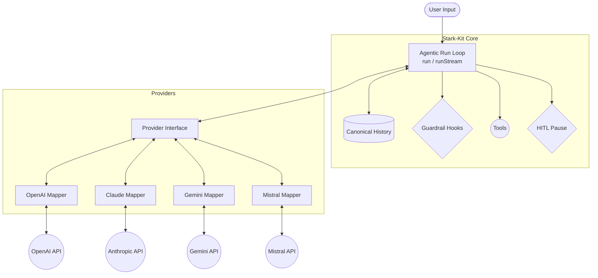

# Stark-Kit 🛡️

Stark-Kit is a lightweight, strictly typed, and completely provider-agnostic TypeScript framework for building powerful AI agents. 

Write your agentic loops once. Run them on OpenAI, Anthropic (Claude), Google (Gemini), or Mistral seamlessly.

---
'gpt-4o-mini'
'gemini-3.6-flash'
'mistral-large-latest'

---


## 🌟 Why Stark-Kit?

Unlike frameworks that tightly couple your business logic to a specific provider's SDK (making it a nightmare to switch from OpenAI to Claude), Stark-Kit relies on a universal `CanonicalMessage` interface. 

It implements **5 Advanced Agentic Patterns** out-of-the-box:
1. **Streaming** (Real-time delta yields for UI responsiveness)
2. **Standardized Tool Outputs** (Graceful error recovery by the LLM)
3. **Guardrails** (Lifecycle hooks for pre/post validation)
4. **Human-in-the-Loop (HITL)** (Pause execution for human approval)
5. **Agent Handoff Orchestration** (Swarm-style multi-agent routing)

---

## 🏗️ Architecture

Stark-Kit cleanly separates the Agent's reasoning loop from the underlying LLM Provider API.



---

## 🚀 Quick Start

### Installation

```bash
bun add stark-kit zod
# Or use npm/yarn/pnpm
```

### Basic Agent Example

```typescript
import { Agent, run, defineTool } from "stark-kit";
import { ClaudeProvider } from "stark-kit/provider/claude/ClaudeProvider"; // Or OpenAIProvider, GeminiProvider, etc.
import z from "zod";

// 1. Initialize your preferred provider (API keys loaded via env automatically)
const provider = new ClaudeProvider();

// 2. Define a typed tool
const weatherTool = defineTool({
  name: "getWeather",
  description: "Get the current weather for a city.",
  parameters: z.object({
    city: z.string().describe("The exact name of the city, e.g. Tokyo"),
  }),
  execute: async ({ city }) => {
    // Real implementation goes here
    return `The weather in ${city} is sunny and 22°C.`;
  },
});

// 3. Create the Agent
const agent = new Agent({
  name: "WeatherBot",
  provider,
  instructions: "You are a helpful weather assistant.",
  tools: [weatherTool],
});

// 4. Run the agentic loop
const response = await run({
  agent,
  messages: "What's the weather like in Tokyo today?",
  maxSteps: 5,
});

if (response.status === "complete") {
  console.log(response.content);
}
```

---

## 🧠 Advanced Agentic Patterns

### 1. Streaming (`runStream`)
Instead of waiting 10 seconds for a final response, yield text chunks and tool execution events in real-time.

```typescript
import { runStream } from "stark-kit";

const stream = runStream({ agent, messages: "Hello!" });

for await (const event of stream) {
  if (event.type === "chunk" && event.chunk.type === "text") {
    process.stdout.write(event.chunk.delta);
  } else if (event.type === "tool_start") {
    console.log(`\n[Running Tool: ${event.toolName}]`);
  } else if (event.type === "done") {
    console.log("\n\nFinal Answer:", event.result.content);
  }
}
```

### 2. Standardized Tool Outputs (`ToolResult<T>`)
Tools can fail. Instead of crashing your Node process, return a `ToolResult` wrapper. Stark-Kit catches `{ success: false }` and feeds the error back to the LLM so it can self-correct!

```typescript
const databaseTool = defineTool({
  name: "queryDB",
  parameters: z.object({ sql: z.string() }),
  execute: async ({ sql }) => {
    try {
      const data = await db.execute(sql);
      return { success: true, data }; // Handled automatically
    } catch (err) {
      // The LLM sees this error and tries a different query!
      return { success: false, error: err instanceof Error ? err.message : String(err) }; 
    }
  },
});
```

### 3. Guardrails (Lifecycle Hooks)
Inject custom logic to intercept, modify, or block prompts and tools before they execute.

```typescript
const secureAgent = new Agent({
  name: "SecureAgent",
  provider,
  instructions: "...",
  hooks: {
    // Runs before calling the LLM
    beforeChat: async (history) => {
      // You can modify the history here, e.g., redacting PII
    },
    
    // Runs before a tool executes
    beforeTool: async (toolName, args) => {
      if (toolName === "deleteFile" && args.path.includes("/etc")) {
        throw new Error("SECURITY VIOLATION: Cannot delete system files.");
        // The loop catches this and tells the LLM the tool failed!
      }
    },
    
    // Runs after a tool executes
    afterTool: async (toolName, result, isError) => {
      return result.replace(/\b\d{3}-\d{2}-\d{4}\b/g, "***-**-****"); // Redact SSNs
    }
  }
});
```

### 4. Human-in-the-Loop (HITL)
Flag sensitive tools to pause the agentic loop. Get human approval, then resume exactly where it left off.

```typescript
import { isHITLPause, resumeRun } from "stark-kit";

const transferFundsTool = defineTool({
  name: "transferFunds",
  requiresApproval: true, // 🛑 Pauses the loop
  parameters: z.object({ amount: z.number(), to: z.string() }),
  execute: async ({ amount, to }) => { /* ... */ }
});

let result = await run({ agent, messages: "Transfer $500 to Alice" });

if (isHITLPause(result)) {
  console.log("Pending Approval for:", result.pendingToolCalls);
  
  // Later, after user clicks "Approve" in your UI:
  result = await resumeRun(result, {
    [result.pendingToolCalls[0].toolCallId]: { action: "approve" } 
    // Or action: "reject", reason: "Insufficient funds"
    // Or action: "modify", modifiedArgs: { amount: 100, to: "Alice" }
  });
}
```

### 5. Manager / Handoff Orchestration
Build Swarm-style architectures where a central triage agent routes tasks to specialized sub-agents.

```typescript
import { createHandoffTool } from "stark-kit";

const billingAgent = new Agent({ name: "Billing", instructions: "Handle refunds.", provider });
const supportAgent = new Agent({ name: "Support", instructions: "Handle tech issues.", provider });

const triageAgent = new Agent({
  name: "Triage",
  provider,
  instructions: "You route user queries to the correct specialized agent.",
  tools: [
    createHandoffTool(billingAgent), // Creates a "transfer_to_Billing" tool
    createHandoffTool(supportAgent)
  ]
});

// If the LLM decides this is a billing issue, it calls transfer_to_Billing.
// Stark-Kit detects this, swaps the active agent, injects the new context, 
// and continues the loop seamlessly!
const response = await run({ agent: triageAgent, messages: "I need a refund!" });

console.log(response.agent.name); // Outputs: "Billing"
```

---

## 🛠️ Supported Providers

Initialize any provider and pass it to your Agent. API keys are automatically picked up from `.env`.

- **OpenAI**: `import { OpenAIProvider } from "stark-kit";` (Uses `OPENAI_API_KEY`)
- **Anthropic / Claude**: `import { ClaudeProvider } from "stark-kit";` (Uses `ANTHROPIC_API_KEY`)
- **Google / Gemini**: `import { GeminiProvider } from "stark-kit";` (Uses `GEMINI_API_KEY`)
- **Mistral**: `import { MistralProvider } from "stark-kit";` (Uses `MISTRAL_API_KEY`)

---

## 📜 License
MIT License. Created by [Mehul Arora](https://www.mehularora.dev).
